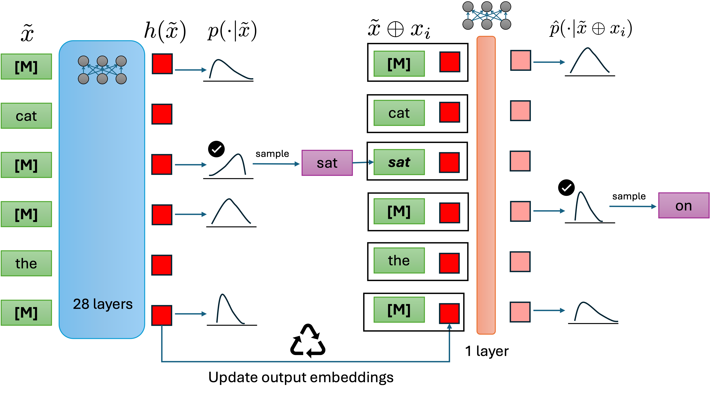

# Enabling Approximate Joint Sampling in Diffusion LMs

We introduce **ADJUST**, a novel way to approximately sample multiple tokens from the joint distribution of masked discrete diffusion models ([LLaDa](https://huggingface.co/GSAI-ML/LLaDA-8B-Instruct), [Dream](https://huggingface.co/Dream-org/Dream-v0-Instruct-7B)) in a single full-model forward pass. 

This codebase is anonymized for ICML 2026 double-blind peer-review. The code has three broad categorization : 



## Code Organization
1. ```jointsampler.py```: Lightning module having the core training/inference logic
2. ```eval.py```: Adds support for LMEval based evaluation
4. ```data_utils.py```: Dataloaders based supporting functions
5. ```utils.py```: All other supporting functions
6. ```models/```: Architecture for the ADJUST layer (supports only [Dream](https://huggingface.co/Dream-org/Dream-v0-Instruct-7B) in this version) 
7. ```configs/```: Config files for generations, data loading, and other training parameters. 
8. ```scripts/```: Shell scripts for data generation, model training and model evaluation

## Running the Repository

### Step 1 : Data Generation

First step for training the ADJUST model is generating inference trajectories. For training "pretrained-only" models, we use unconditional generation, which can be made by running 

```bash scripts/lightning_gen_uncond.sh```

For Dream-Instruct model, we use MetaMath prompts for generation. For Dream-Instruct reponse generation run 

```bash scripts/lightning_gen_metamath.sh```

### Step 2 : Training ADJUST

For training adjust, first create a new data config ```.yaml``` file inside ```config/data/```. This file should point to the generated data path in a step 1. The model can then be trained by running 

```bash scripts/lightning_run.sh```

### Step 3 : Evaluating ADJUST

Given a trained ADJUST checkpoint, for downstream evaluation, run 
```bash scripts/lightning_eval_gsm8k.sh```

and for uncondition generation (for "pretrained-only" Dream) run 
```bash scripts/lightning_mauve_eval.sh```


## Trained Checkpoints

Our trained checkpoints are released on huggingface, along with the appropriate code to support **ADJUST** based inference. 

These include : 

1. Dream-7B-Base - ADJUST
2. Dream-7B-Coder - ADJUST
3. LLaDA-8B-Base - ADJUST

Due to anonymity requirements, we have ommited these links.
Post ICML rebuttal, we will post the link for the huggingface models here. 
